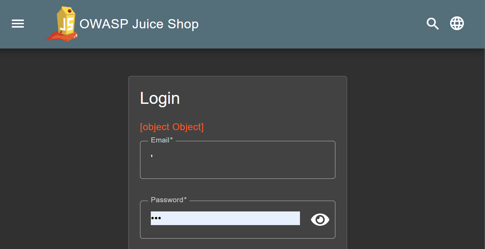
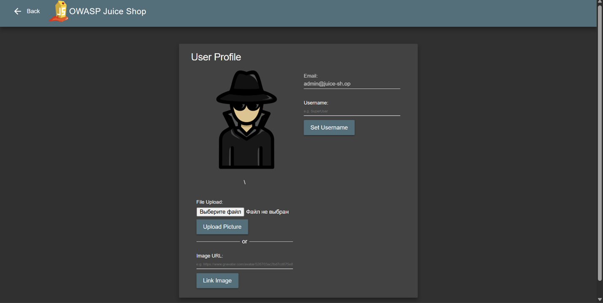
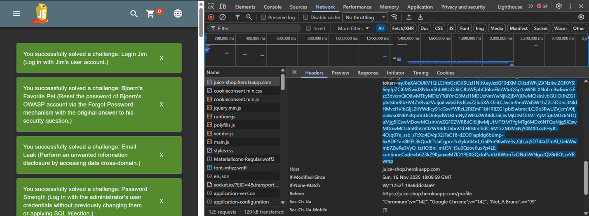
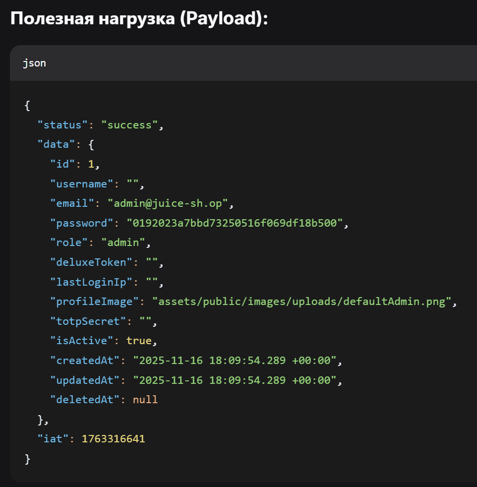
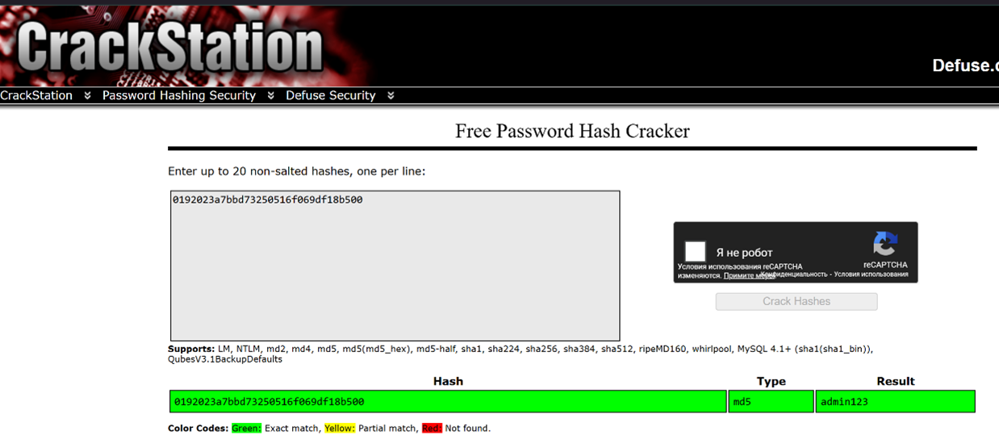
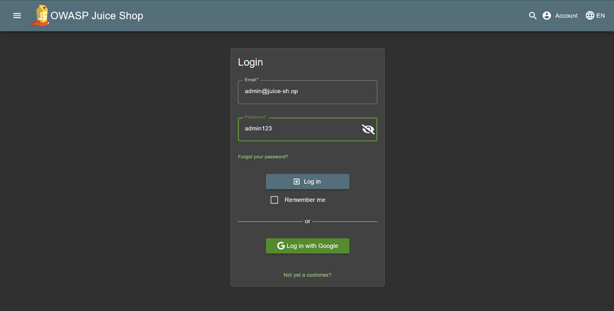
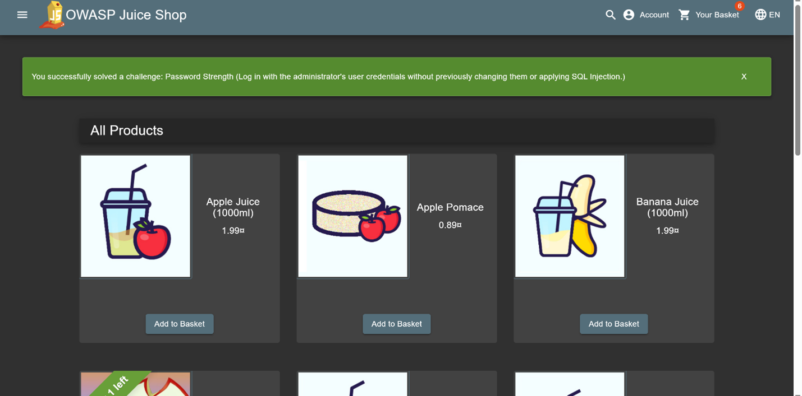

# Контрольная работа 2
*Студент Никитина София*
*Группа УИБО-06-24*
  
## Задание 1. SQL-injection и логин с административными правами
При вводе значка ' в поле логин и случаного пароля получаем странный ответ.

Это означает что база данных пользователей реализована с уязвимостями

Ввод ' or 1=1;-- в поле логин и случаного пароля позволили залогиниться по пользователем admin@juice-sh.op. Предположим, что это администратор.

## Ответы на вопросы
- Что такое SQL инъекция?
  SQL инъекция - это одна из самых распространенных и опасных уязвимостей в веб-приложениях. Она возникает, когда злоумышленник может вставить и выполнить свой собственный вредоносный SQL-код в запросах приложения к базе данных.
- Почему ввод строки ' or 1=1;-- позволил войти в аккаунт администратора?
  Эта строка превращает SQL-запрос вида SELECT ... WHERE username = '[input]' в SELECT ... WHERE username = '' OR 1=1;-- ', где условие1=1всегда истинно, что возвращает всех пользователей из базы, и приложение входит под первым из них (часто администратором), игнорируя проверку пароля благодаря комментарию--`.
- Как защитить web-ресурс от подобного рода атак?
  Используйте параметризованные запросы (Prepared Statements) — это главный метод. Дополнительно: применяйте ORM, валидируйте входные данные, настройте минимальные привилегии для БД, используйте WAF и регулярно тестируйте безопасность. Никогда не склеивайте SQL-запросы с пользовательским вводом.

## Задание 2. Узнайте пароль администратора
Находясь после SQL под логином администратора - включаем DevTools и обновляем страницу OWAS Juice. Переходим в запрос домена - и находим заголовок кукис. Находим IDTOKEN

Копируем его - это строка закодированная Base64. Декодируем онлайн с помощью ИИ. Получаем результат:

Исходя из анализа кода
- Ключевая информация:
* Status: статус операции — «успешно».
* Data: объект с данными пользователя:
* ID пользователя: 1
* Email: admin@juice-sh.op
* Role: admin 
* IsActive: true 
* CreatedAt/updatedAt: дата создания/обновления аккаунта.
Пароль (MD5 хэш): 0192023a7bbd73250516f069df18b500. Атака на него даже с помощью онлайн крэкера позволяет узнать строку пароля - admin123:

Проверяем: 

# IBiZI-kr2

